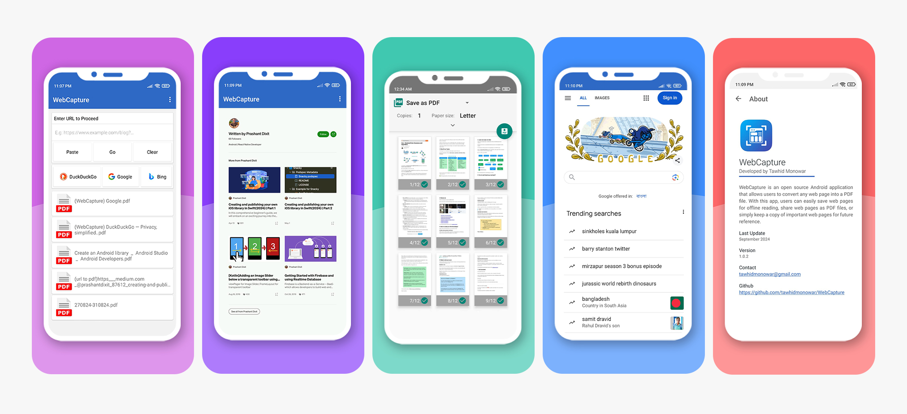

<p align="center">
  
  <h3 align="center">WebCapture</h3>
  <p align="center">
    WebCapture is an open source Android application that allows users to convert any web page into a PDF file. With this app, users can easily save web pages for offline reading, share web pages as PDF files, or simply keep a copy of important web pages for future reference.
    <br/>
    <br/>
    <a href="https://github.com/tawhidmonowar/WebCapture/releases">Download</a>
    .
    <a href="https://github.com/tawhidmonowar/WebCapture/issues">Report Bug</a>
    .
    <a href="https://github.com/tawhidmonowar/WebCapture/issues">Request Feature</a>
  </p>
</p>

<p align="center">
<a href="https://apt.izzysoft.de/fdroid/index/apk/com.tawhid.webcapture">
    
</a>
<a href="https://www.openapk.net/webcapture/com.tawhid.webcapture/">
    
</a>
<a href="https://github.com/tawhidmonowar/WebCapture/releases">
    
</a>
</p>


 
 
 
 




## Features
- Convert any Web Page into PDF file.
- Save PDF files to device storage or share with other apps.
- Open PDF from the app.
- Download YouTube video thumbnail.
- Copy video title, description, and tags.
- Extract hashtags from the video.
- Simple and easy-to-use interface.
- Fast and reliable conversion process.
- Open-source and free to use.

## Support Me

<a href="https://www.buymeacoffee.com/tawhidmonowar"></a>

## To-Do
- [x] URL Validation
- [x] No Internet Connection Message
- [x] URL Paste & Clear Buttons
- [x] Search Engine Buttons
- [x] Splash Screen
- [x] About Activity
- [x] Download YouTube video thumbnail
- [x] Copy video title, description, and tags
- [ ] Theme Selection
- [ ] Swap Refresh
- [ ] Long Screenshots
- [ ] Progress Bar in WebView
- [ ] Save History
- [ ] PDF Search Option
- [ ] Translation 
- [ ] Night Mood

## Installation

1. Clone the repository:
```
git clone https://github.com/tawhidmonowar/WebCapture.git
```
2. Open the project in Android Studio.
3. Build and run the project using Gradle.

## Usage
To convert a Web Page into PDF file:
1. Enter the URL in the input field.
2. Press the "Convert" button.
3. Wait for the conversion process to complete.
4. Save the PDF file to device storage.

## Contributing
Contributions are welcome! If you find any bugs or issues, please submit them in the [issue tracker](https://github.com/tawhidmonowar/WebCapture/issues). If you would like to contribute code, please fork the repository and create a pull request.

## Save Palestine
Stand up for Palestine's existence! It is disappearing from Maps, let us raise our voices and demand a fair representation for this land and its people.
[Don't watch this video!](https://youtu.be/O5fbyEV36pU)


## Analytics


## Contributors
<a href="https://github.com/tawhidmonowar/WebCapture/graphs/contributors">
  
</a>

## Author
**Tawhid Monowar** - *Computer Science & Engineering Student* <br>
[LinkedIn](https://www.linkedin.com/in/tawhidmonowar) | [Portfolio](https://tawhidmonowar.github.io)  | [Email](mailto:tawhidmonowar@gmail.com)
